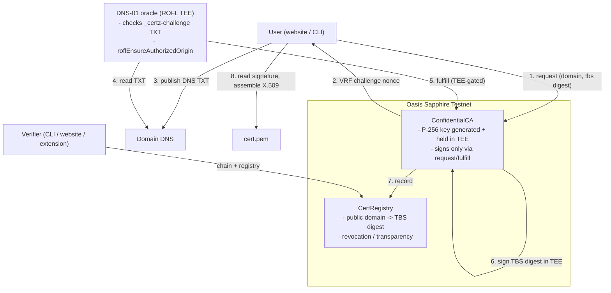

# Certz

**A confidential, on-chain certificate authority on Oasis Sapphire.**

Certz issues real X.509 TLS certificates signed by a CA private key that is
generated and lives **only inside an Oasis Sapphire confidential smart contract
(a TEE)** — no human or operator ever sees it. Domain ownership is proven with
an ACME-style DNS-01 challenge verified by a TEE oracle, and every issuance is
recorded in a public, auditable on-chain registry (Certificate-Transparency
style). A verifier checks a presented certificate against the on-chain CA root
and registry **out of band** (DANE/CT-style), layered on top of normal HTTPS.

## Read this first — what Certz is and is NOT

This is a **working research/demo on Sapphire testnet**, proven end to end.

- It **does** generate a CA key inside the TEE, sign genuine X.509 certificates
  with it, prove domain ownership via DNS-01, anchor issuance on-chain, and
  verify the chain (confirmed independently with OpenSSL).
- It is **not** trusted by normal web browsers. Browser TLS trust requires
  inclusion in root programs (Mozilla/Apple/Microsoft/Chrome) after audits —
  out of scope and not a software task.
- The browser extension does **out-of-band** verification only: it checks the CA
  chain, the on-chain registry, and a **live proof-of-possession** (the site
  signs a fresh nonce; the extension verifies it against the on-chain-anchored
  key). It does **not** and cannot override the browser's TLS trust. See
  [`extension/WHY-NOT-HARD.md`](extension/WHY-NOT-HARD.md).

## Architecture



## Repository layout

| Path | What |
|------|------|
| [`brain/contracts`](brain/contracts) | Solidity: `ConfidentialCA`, `CertRegistry`, `CertzCASigner`; Hardhat deploy + e2e scripts |
| [`brain/sdk`](brain/sdk) | `@certz/sdk`: build TBSCertificates, splice the CA's DER signature into X.509, verify chain + registry |
| [`brain/cli`](brain/cli) | `certz` CLI: `info`, `ca-root`, `verify`, `issue` |
| [`brain/oracle`](brain/oracle) | DNS-01 oracle daemon + ROFL/Docker scaffolding |
| [`website`](website) | Next.js marketing + app site (Create / Verify) |
| [`demo-site`](demo-site) | A sample site that holds a Certz cert and proves possession of its key via `/.well-known/certz/` |
| [`extension`](extension) | MV3 verifier: CA chain + on-chain registry + live proof-of-possession |

## Deployed (Sapphire testnet, chainId 23295)

- `CertRegistry`: `0x95D81e4B8D848A96ffe9112B9d054779c836B930`
- `ConfidentialCA`: `0x0BB607Caa6BBE66EF3986dfd3ffDa22eD52cb64E`

(See [`brain/contracts/deployments/sapphire-testnet.json`](brain/contracts/deployments/sapphire-testnet.json) and the CA root cert.)

## Quick start

```bash
# 1. SDK: prove the X.509 pipeline locally (no chain needed)
cd brain/sdk && npm install && npm run build && npm test

# 2. Contracts: deploy your own CA to Sapphire testnet
cd ../contracts && npm install
cp .env.example .env   # add a funded testnet PRIVATE_KEY (faucet.testnet.oasis.io)
npm run build && npx hardhat run scripts/deploy.ts --network sapphire-testnet
CERTZ_DOMAIN=demo.example npx hardhat run scripts/e2e.ts --network sapphire-testnet

# 3. CLI: verify a cert against the chain
cd ../cli && npm install
node certz.mjs info
node certz.mjs verify demo.certz.example ../contracts/deployments/issued/demo.certz.example.pem

# 4. Oracle (dev mode): real DNS check, owner-gated issuance
cd ../oracle && npm install
PRIVATE_KEY=0x... node oracle.mjs --mode dev --watch

# 5. Client-side verification end to end
cd ../../demo-site && PRIVATE_KEY=0x... npm run issue && npm start  # http://localhost:8788
cd ../extension && npm install && npm run build                    # bundles the SDK
#    load extension/ unpacked in chrome://extensions, open the popup on the demo tab
```

## Client-side verification (the extension)

The verifier never trusts the site's word. For the current tab it (a) fetches the
site's Certz certificate, (b) verifies it chains to the **pinned** Certz CA root,
(c) confirms `sha256(TBSCertificate)` is recorded and not revoked **on-chain**,
and (d) sends a **fresh random nonce** that the site must sign with its leaf
private key — then verifies that signature against the public key in the cert
(WebCrypto P-256). Step (d) is what proves the *live* server is authentic and is
non-replayable. We **verify a fresh challenge** rather than "recover a key from
the cert signature": P-256 recovery is non-standard/unsupported in browsers, and
a static signature proves nothing about the live server.

## How signing actually works (the novel bit)

`Sapphire.sign(Secp256r1PrehashedSha256, ...)` runs inside the enclave and
returns an **ASN.1 DER ECDSA signature** — exactly the format X.509 expects in
`signatureValue`. So the SDK builds the TBSCertificate, hashes it, the contract
signs the digest with the TEE-held key, and the DER signature is spliced
straight into a finished certificate. The key never leaves confidential state;
issuance is gated so only an attested ROFL TEE oracle (which verified DNS) can
trigger it.

## License

Apache-2.0.
