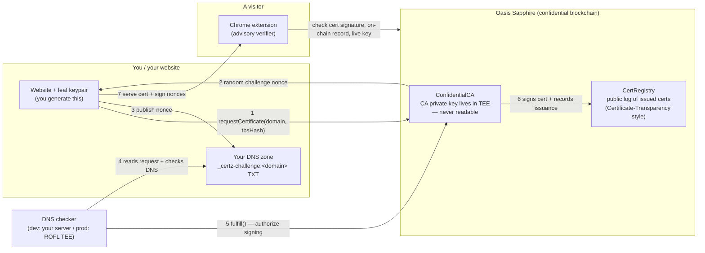
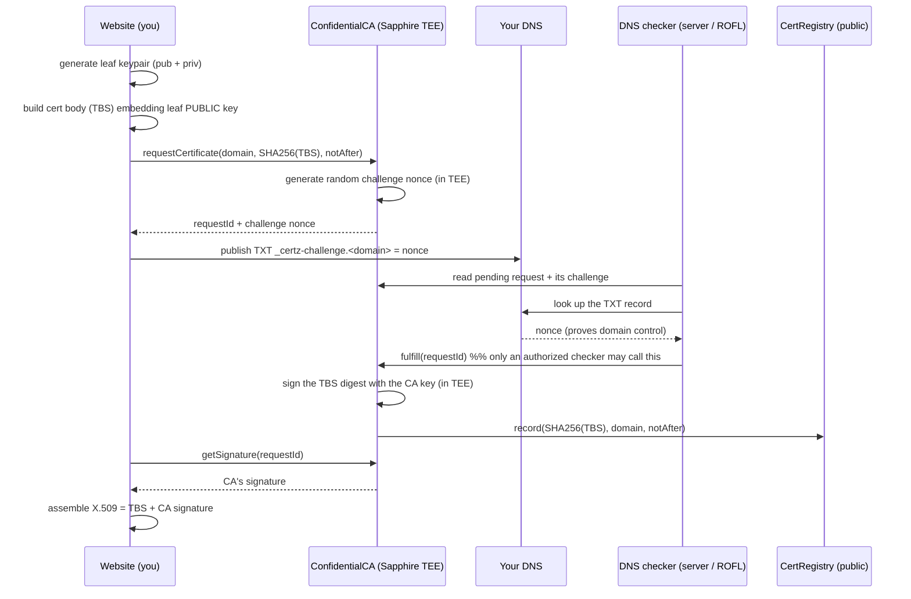
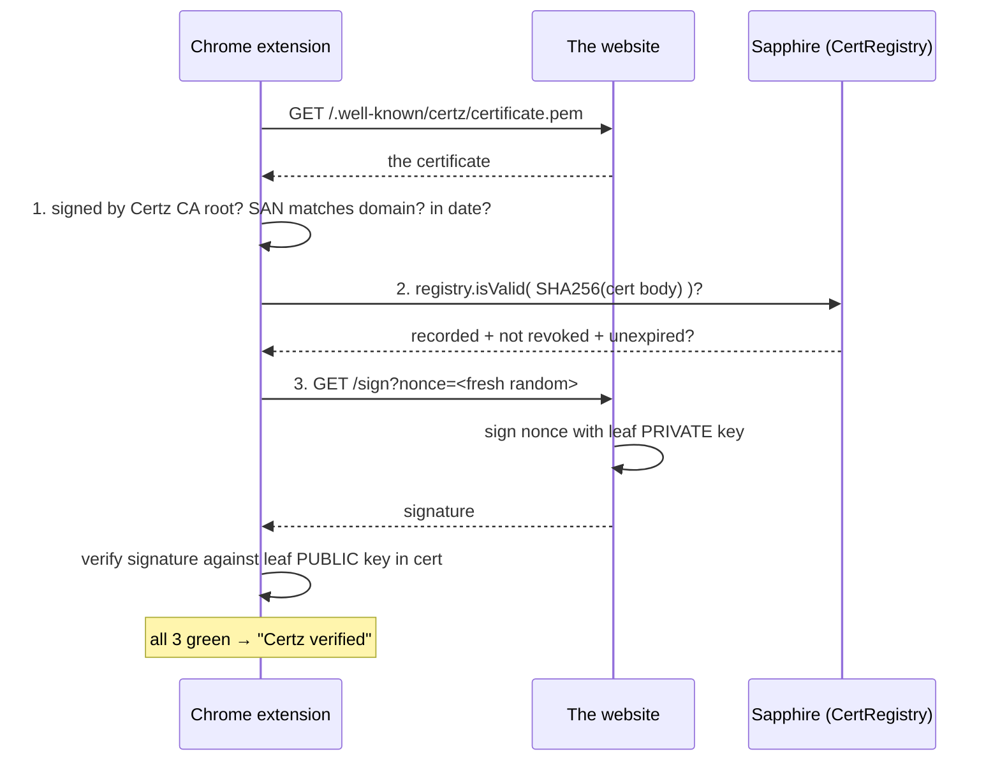
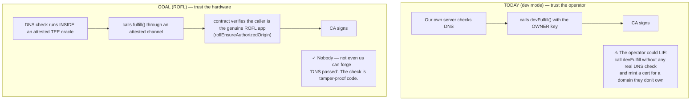

# Certz — How It Works

**Certz is a certificate authority (like Let's Encrypt) whose signing key lives inside
a blockchain's secure hardware (a TEE on Oasis Sapphire) instead of a company's server,
and every certificate it issues is logged on a public, auditable blockchain.**

Trust moves from *"a company and its servers"* to *"tamper-proof hardware + a public ledger."*

---

## 1. The big picture

---

## 2. Issuance — getting a certificate

**Key facts people get wrong:**
- The **leaf private key is yours** and is *never* sent to the CA. Only the **public** key goes into the cert.
- The CA signs the **cert body (TBS)**, not anything you signed. That CA signature *is* the authority.
- The blockchain stores a **fingerprint** (SHA-256 of the cert body) + domain + expiry — **not** the DNS record and **not** the full cert.

---

## 3. Verification — what the extension checks

| Check | Proves | Verified against |
|---|---|---|
| CA signature on the cert | the Certz authority issued it | the CA's pinned public key |
| On-chain registry record | it was really issued & not revoked | the public CertRegistry |
| Fresh-nonce signature | the site holds the key **right now** | the leaf public key in the cert |

The fresh nonce is what stops replay: a copied cert is public, but only the real key-holder can sign a random value that didn't exist a second ago.

---

## 4. Why we need ROFL (the one trust gap left)

The question is **not** "how do *you* prove you own the domain?" — you do that by publishing the
DNS record. The question is: **who tells the CA the DNS record is really there, and why should
anyone believe them?**

**In one sentence:** ROFL isn't about *your* dashboard access — it's about making the
"the DNS record exists" claim come from **tamper-proof hardware running known code**, so the
CA operator can't secretly issue certs without a real ownership check. Until ROFL is wired in,
domain validation is *self-asserted by the operator* — which is fine for a demo, but it's the
gap between "trust me" and "trust the math."

---

## 5. Honest limitations

- **Advisory, not native.** Browsers don't trust Certz; this rides *beside* HTTPS via an
  extension. It can say "verified" but can't change what Chrome's TLS stack trusts.
- **Domain validation isn't trustless yet** (see §4 — needs ROFL).
- **Proof of possession is deferred.** Classic ACME makes you self-sign a CSR at request time;
  Certz instead proves possession later via the nonce challenge.
